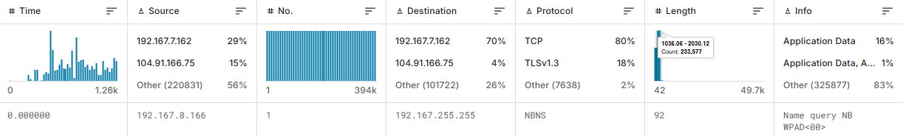
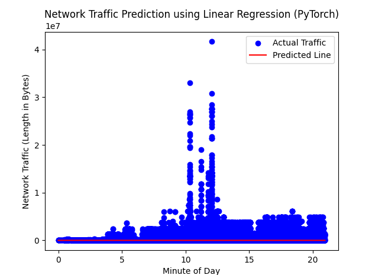
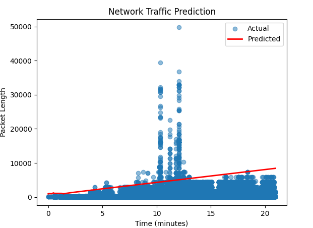

## Network-Traffic-Size-Predictions

## Purpose

* The purpose of this project was to study the relationship between linear and non linear models and to see what the results would be used with the same set of data. The intention was to do this research and record it in my research paper: https://github.com/Justinfinn2891/Cognitive-Research

## Dataset 

I was working with a dataset I found from kaggle here: https://www.kaggle.com/datasets/ravikumargattu/network-traffic-dataset

## Results

With the linear regression model I got this graph: 

With the non linear model I got this graph:

The prediction I got for the non linear model for 3600 seconds was: 2000 bytes per packet with a loss rate of .96 (I am trying to find ways to lower this currently) 

## How to run

You will need the following libraries:

* pip install torch
* pip install pandas
* pip install numpy
* pip install matplotlib

Then clone the repository and execute with python app.py 
